[PyCharm](https://www.jetbrains.com/pycharm) - это IDE для разработки на Python
с поддерживаемой бесплатной версией (Community Edition).

## Установка

Перейдите по [ссылке](https://www.jetbrains.com/pycharm/download/?section=windows) на официальный сайт и скачайте установочный файл `PyCharm Community Edition`.

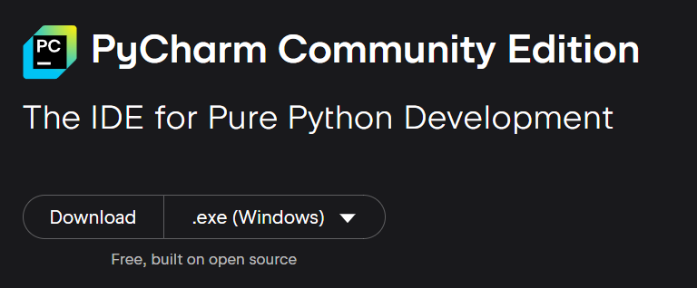

 Запустите его и следуйте инструкциям по установке. Выберите следующие опции:

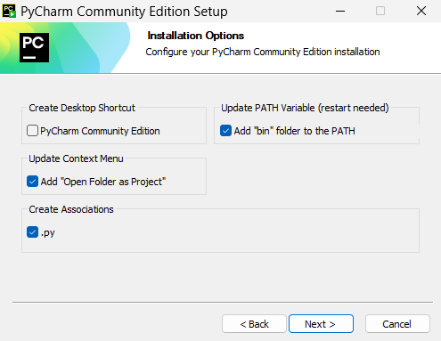

После установки `перезапустите ПК`

## Настройка

### Добавление RevitAPIStubs

Скачайте архив с RevitAPIStubs по [ссылке](https://github.com/BIMOpenGroup/RevitAPIStubs/releases/latest). В этом архиве находится python код,
который помогает PyCharm делать подсказки по API Revit.

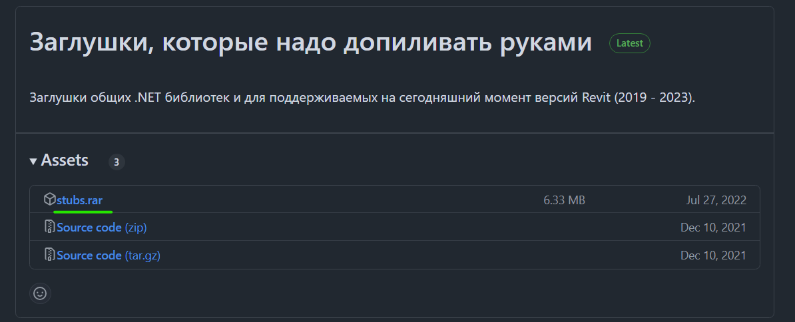

Распакуйте содержимое архива. Папки `common` и `revit`:

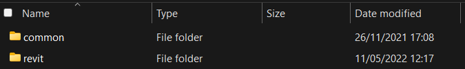

### Добавление интерпретаторов

Перед тем, как добавлять интерпретаторы, убедитесь, что на вашем ПК установлена сама платформа [ТИМ4Еверёне](../../install/_index.md).

В главном окне при запуске PyCharm перейдите в раздел `Customize -> All settings`:

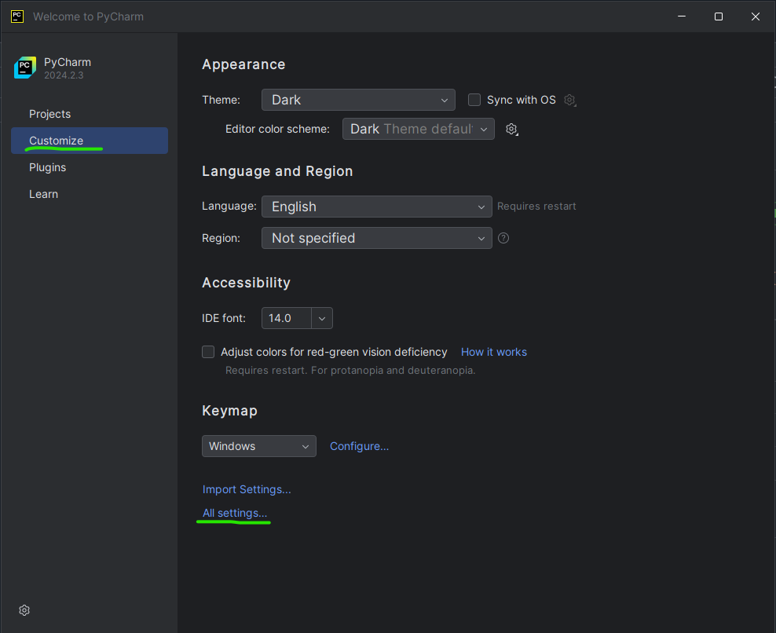

Затем перейдите в раздел `Python Interpreter -> Show All`

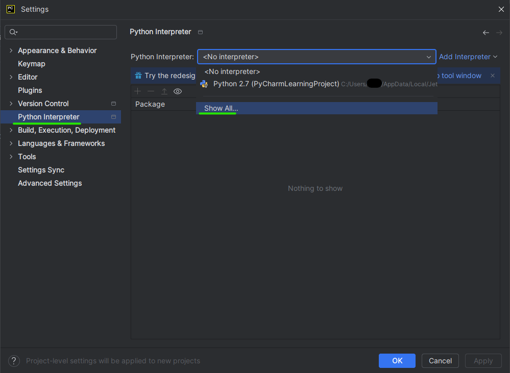

Нажмите `+` чтобы добавить интерпретатор:

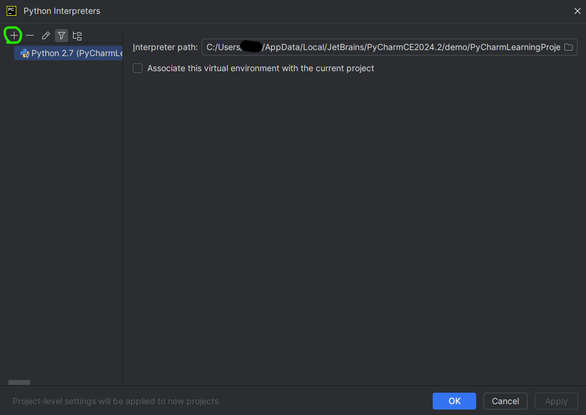

В открывшемся окне выберите раздел Virtual Environment. В качестве Base interpreter укажите путь к `python.exe`
(`python2.7` который вы устанавливали выше). Т.к. stub файлы отличаются для каждой версии Revit,
то нужно создать интерпретаторы под все версии Revit, которые у вас установлены, и разместить их в отдельных директориях.
Директории укажите в `Location`.

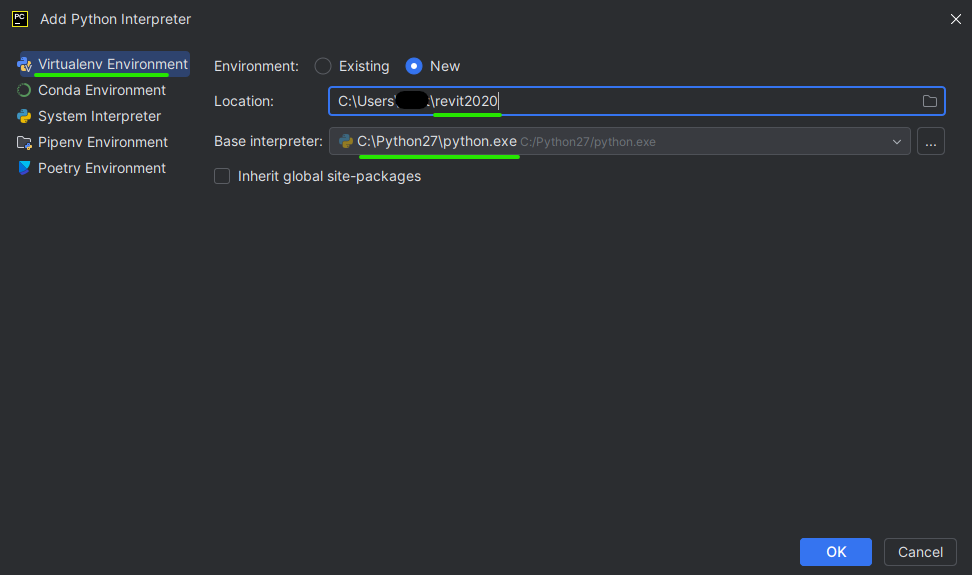

Затем необходимо настроить пути для каждого интерпретатора. Чтобы открыть окно настроек, нажмите ПКМ на интерпретатор и 
выберите `Show Interpreter Paths`:

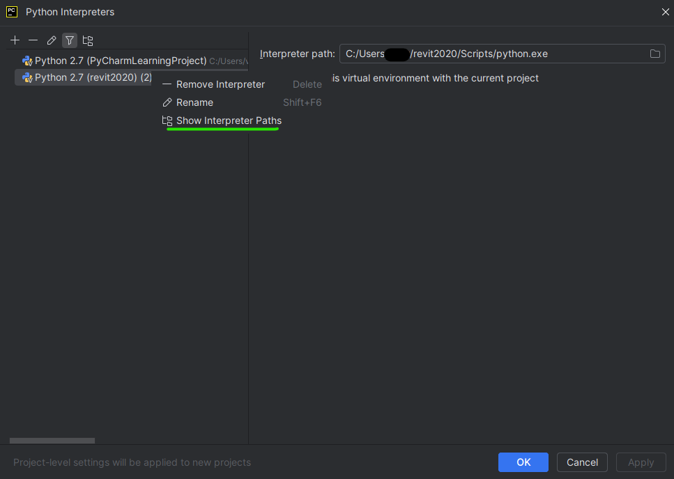

Для каждого добавленного интерпретатора необходимо `добавить 4 пути`:

- путь к соответствующим stubs файлам из архива, находящимся в revit/20xx (будет разный для каждого интерпретатора).
- путь к common файлам также из архива (будет одинаковый для всех интерпретаторов).
- путь к папке `%AppData%\pyRevit-Master\pyrevitlib` (будет одинаковый для всех интерпретаторов), 
    которая создается при установке пайРевит.
- путь к папке `%AppData%\pyRevit\Extensions\BIM4Everyone.lib` (будет одинаковый для всех интерпретаторов),
    которая создается при установке платформы ТИМ4Еверёне.

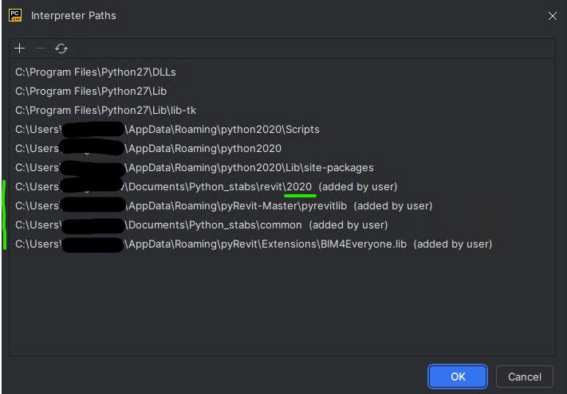

### PyCharm custom properties

Перейдите в раздел `Edit Custom Properties`:

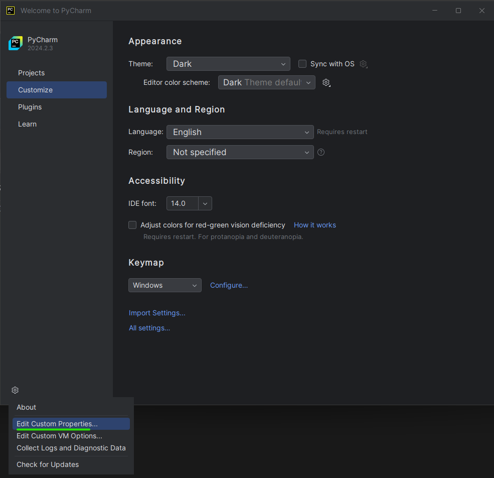

И замените весь существующий текст на следующий:

```
#---------------------------------------------------------------------
# Maximum file size (kilobytes) IDE should provide code assistance for.
# The larger file is the slower its editor works and higher overall system memory requirements are
# if code assistance is enabled. Remove this property or set to very large number if you need
# code assistance for any files available regardless their size.
#---------------------------------------------------------------------
idea.max.intellisense.filesize=40000

#---------------------------------------------------------------------
# Maximum file size (kilobytes) IDE is able to open.
#---------------------------------------------------------------------
idea.max.content.load.filesize=40000

```
