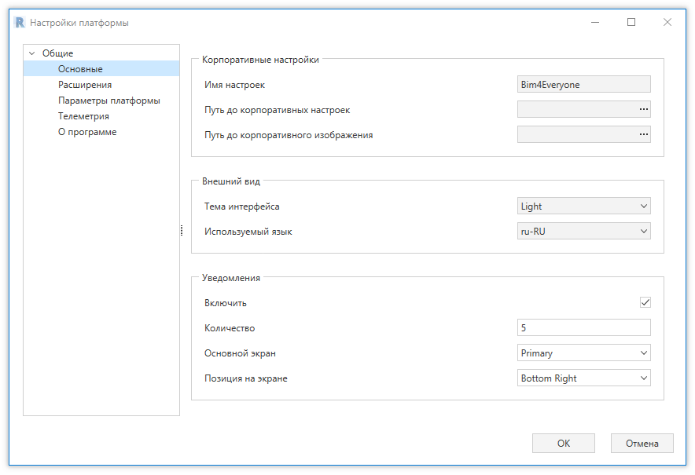
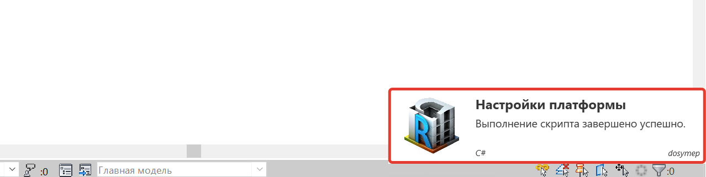

Для настройки платформы используется окно настроек. 
Данное окно можно открыть с любой вкладки платформы, нажав кнопку "Настройки" на панели "Установки".

В данном окне можно изменить глобальные настройки платформы, настройки вкладок, настройки телеметрии  т.д.

# Раздел "Расширения"

В данном разделе с помощью галочек можно включить/выключить необходимые вкладки платформы. 
Здесь доступны непосредственно вкладки Bim4Everyone, а также вкладки pyRevit.